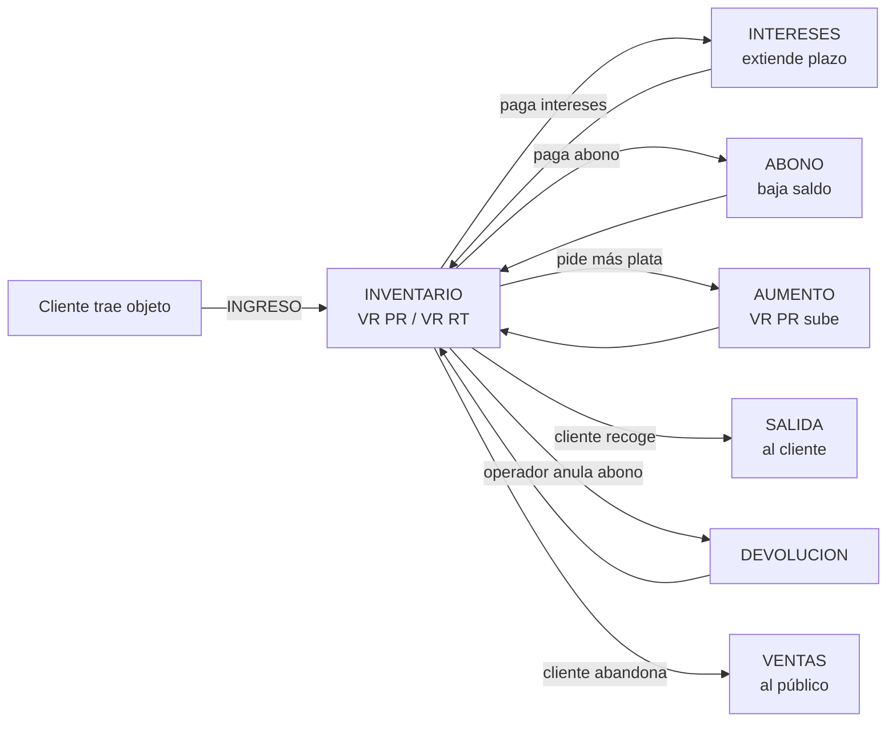

# Reporte ejecutivo — Casa de Empeño "La Comuna" (SCORPION)

> **Para uso con Claude (modo asesor experto).**
> Copia y pega este archivo completo en una nueva conversación con Claude.

---

## ROL QUE QUIERO QUE ASUMAS

Actúa como **asesor financiero senior y consultor de negocios** con +15 años de experiencia en:
- Casas de empeño / lending colateralizado
- Optimización de capital de trabajo y rotación de inventario
- Tableros de control gerencial (KPIs)
- Detección de fraude interno y fugas operativas
- Diseño de incentivos y políticas de cobro

**Estilo de respuesta:**
- Conciso. Sin paja. Sin "como gran modelo de lenguaje…".
- Estructurado en bloques claros con títulos cortos.
- Si es útil, usa **diagramas Mermaid**, **tablas markdown** o pseudo-gráficos ASCII.
- Cada sugerencia debe traer **acción concreta**, **impacto esperado** y **prioridad (alta/media/baja)**.
- Habla como humano. No me digas obviedades del manual de finanzas 101.

**Lo que quiero al final:**
1. Diagnóstico del modelo (fortalezas + riesgos invisibles).
2. KPIs que **debo** estar midiendo y no estoy midiendo.
3. Reglas de negocio que probablemente me están sangrando dinero.
4. 5 mejoras de alto impacto, ordenadas por ROI esperado.
5. 3 cosas que solo un experto vería y que casi nadie en mi rubro hace.

---

## 1. EL NEGOCIO EN UNA FRASE

Casa de empeño física. El cliente deja un objeto (moto, audio, pasacintas, anillo, herramienta, etc.) como prenda y recibe **dinero prestado** (`VR PR`). Para retirar el objeto debe pagar un valor mayor (`VR RT`). La diferencia es la **utilidad bruta** del préstamo. El cliente puede pagar **intereses periódicos** para extender el plazo, hacer **abonos parciales**, pedir un **aumento** sobre el préstamo, o no volver — en cuyo caso el objeto pasa a venta.

Operación 24/7 en **3 turnos** (1, 2 y 3) con un operador por turno y caja independiente por turno.

---

## 2. CICLO DE VIDA DE UN ARTÍCULO



---

## 3. OPERACIONES (en orden de uso)

| Operación | Qué hace | Efecto en INVENTARIO | Efecto en CAJA |
|---|---|---|---|
| **INGRESO** | Recibe objeto, presta `VR PR` y se cobrará `VR RT` al retiro | Crea fila nueva | `CONTRATOS` += VR PR (egreso) |
| **ABONO** | Pago parcial sobre la deuda | `VR AB` += abono | `RETIRO` += abono (ingreso) |
| **INTERESES** | Pago de interés para extender plazo | `VR IN` += int; `TOT IN` += int | `RETIRO` += int (ingreso) |
| **AUMENTO** | Préstamo extra sobre el mismo objeto | `VR PR` += aumento; `VR RT` += pago_aumento | `CONTRATOS` += aumento |
| **SALIDA** | Cliente recoge el objeto | mueve fila a tabla `SALIDAS` | `RETIRO` += valor pagado al recoger |
| **DEVOLUCION** | Operador devuelve plata al cliente (anula abono) | resta de `VR AB` y/o `VR IN` (en orden) | `RETIRO` −= valor (egreso) |
| **ESPERA** | Marca el artículo como "en espera" (no toca dinero) | columna `ESPERA` | — |
| **RETIROS (PEDIR_SIN_PAGAR)** | Retiro físico provisional sin pago | columna `RETIROS` | — |
| **VENTAS** (lote) | Vender objetos abandonados | mueve filas a `VENDIDO` y borra de `INVENTARIO` | `VENTAS` += suma del lote |
| **GUARDADERO** | Servicio de guardado (sin objeto) | tabla `GUARDADERO` | `GUARDA` += valor |
| **BAR** | Venta de barra (negocio paralelo) | tabla `BAR` | `BAR` += valor |
| **GASTOS** | Egresos del operador | tabla `GASTOS` | `GASTOS` += valor |
| **CAJA BASE** | Monto inicial con que abre el operador su turno | — | `BASE` = valor |

**Cuadre de caja por turno (regla):**
```
CUADRE CAJA  =  BASE + RETIRO + GUARDA + BAR + VENTAS
                  − CONTRATOS − GASTOS
```

---

## 4. SIGNIFICADO DE LAS COLUMNAS DEL SHEETS

Las cabeceras reales del inventario (hoja principal) son:

```
FECHA, OPER, NUMERO, VR PR, VR RT, NOMBRE, CC, ART, DESCRIPCION,
LLEVAR, VR IN, TOT IN, FECHA INT, VR AB, FECHA ABON, ESPERA,
RETIROS, FECHA RETIRO, DES, AUMENTO, FECHA AU, TOTAL, UTIL
```

| Columna | Significa |
|---|---|
| **FECHA** | Fecha + hora del INGRESO original |
| **OPER** | Turno (1, 2 o 3) que hizo la operación |
| **NUMERO** | Identificador único del contrato (6 dígitos) |
| **VR PR** | Valor prestado al cliente (egreso original del operador) |
| **VR RT** | Valor a cobrar cuando el cliente retire (incluye utilidad) |
| **NOMBRE / CC** | Cliente y cédula |
| **ART** | Tipo de artículo (3 letras: MOT, AUD, PAS, etc.) |
| **DESCRIPCION** | Detalle libre del objeto |
| **LLEVAR** | Marca para mover a otra ubicación / bodega |
| **VR IN** | Saldo de intereses pendientes (acumulado de la operación INTERESES menos lo descontado por DEVOLUCION) |
| **TOT IN** | Total histórico de intereses pagados sobre este contrato |
| **FECHA INT** | Última fecha de pago de intereses |
| **VR AB** | Total abonado al capital |
| **FECHA ABON** | Última fecha de abono o devolución |
| **ESPERA** | Estado "en espera" |
| **RETIROS** | Marcador "RETIRAR / MAÑANA" para flujo de bodega |
| **FECHA RETIRO** | Fecha del marcador anterior |
| **DES** | Descuento aplicado en SALIDA |
| **AUMENTO** | Historial de aumentos (texto: "10-15-…") |
| **FECHA AU** | Fecha del último aumento |
| **TOTAL** | `VR RT + TOT IN − VR AB − DES` (lo que falta cobrar) |
| **UTIL** | `VR RT − VR PR` (utilidad bruta del contrato) |

Hojas/tablas hermanas y su propósito:
- **CAJA**: una fila por (FECHA, TURNO). Columnas: `BASE, RETIRO, GUARDA, BAR, CONTRATOS, GASTOS, VENTAS, CUADRE CAJA`.
- **HISTORIAL**: log inmutable de cada operación (auditoría).
- **SALIDAS**: contratos cerrados (cliente recogió).
- **VENDIDO**: contratos vendidos al público.
- **RETIROS**: contratos marcados para retiro físico.
- **GUARDADERO / BAR / GASTOS**: tablas de soporte por operación.
- **ENVIOS / DEVOLUCIONES (control)**: control diario de movimientos físicos a bodega.

---

## 5. REGLAS DURAS DEL NEGOCIO

1. `NUMERO` es único en todo el universo (no se repite entre INVENTARIO, SALIDAS y VENDIDO).
2. La utilidad esperada de un contrato sale al firmarlo: `UTIL = VR RT − VR PR`. Es típicamente **20–25 %** sobre VR PR.
3. Los **intereses son la verdadera maquinita**: si el cliente nunca recoge, los intereses periódicos compensan el capital atado.
4. Si el cliente **no paga intereses ni abona** en X días → el objeto se vende.
5. Una **DEVOLUCION** nunca puede ser mayor que `VR AB + VR IN` del contrato.
6. Las **ventas se hacen en lote**: si uno solo de los `NUMERO` no existe, se rechaza todo el lote (TODO O NADA).
7. La caja se cierra **por turno y por día**, no por día completo.

---

## 6. NÚMEROS DE REFERENCIA (perfil del negocio)

- ~**1.300** contratos activos en inventario en cualquier momento.
- **3 turnos diarios** (24/7).
- Operación principal: **moto y audio**, también casi todo lo que tenga reventa.
- Tickets típicos: VR PR de **40 a 800** miles, VR RT 20–25 % arriba.
- Mezcla típica de uso: muchos contratos chicos (50/70) + pocos contratos grandes (800/1000).

---

## 7. LO QUE NECESITO DE TI (ENTREGABLE)

Estructura tu respuesta exactamente así, sin desviarte:

### A. Diagnóstico (máximo 8 viñetas)
Fortalezas y debilidades del modelo, incluyendo riesgos no obvios (fraude operador, fuga por DES, capital muerto en inventario viejo, etc.).

### B. Tablero de KPIs sugerido
Tabla con: **KPI · Fórmula · Meta sugerida · Frecuencia de revisión**.
Mínimo 8 KPIs. Algunos deben ser de los que un dueño promedio NO mide (no me sirve "ventas mensuales").

### C. Fugas probables de dinero
Lista priorizada de prácticas/configuraciones que probablemente me estén costando plata sin que lo vea, con **estimado de impacto en %** sobre la utilidad.

### D. 5 mejoras de alto impacto
Ordenadas por ROI esperado. Cada una con:
- **Acción** (qué hacer, en imperativo)
- **Impacto esperado** (en %, $ o tiempo)
- **Esfuerzo** (S / M / L)
- **Prioridad** (alta / media / baja)

### E. 3 jugadas que solo un experto vería
Cosas no obvias, que la competencia probablemente no hace. Pueden ser de pricing, mix, segmentación de cliente, optimización de capital, scoring interno, etc.

### F. Un mini-diagrama
Un Mermaid o tabla visual que resuma el flujo de capital del negocio (de dónde sale, en dónde se atasca, por dónde regresa).

---

## 8. CONTEXTO TÉCNICO (por si te preguntas)

- Backend: Node.js sobre Vercel + Supabase (PostgreSQL).
- Toda operación se registra en `HISTORIAL` (auditable).
- La app tiene rol "operador" en cada turno y un panel admin protegido por contraseña para editar tablas en vivo.
- Hay funcionalidad de **EDITAR** que recalcula deltas en CAJA si se corrige una operación pasada (ajusta el campo correcto del turno y día originales).

---

## 9. RESTRICCIÓN FINAL

- **No me mandes un libro.** Total estimado: 2–4 páginas.
- Si vas a usar números, **ponlos**. Nada de "considera analizar el rendimiento".
- Si una sugerencia depende de un dato que no te di, asume un valor razonable y márcalo como `(asumiendo X)`.
- Si tienes dudas críticas, lístalas al final en una sección **"Preguntas que necesito que respondas para refinar"**, máximo 5.

---

**Empieza por la sección A. Diagnóstico.**
